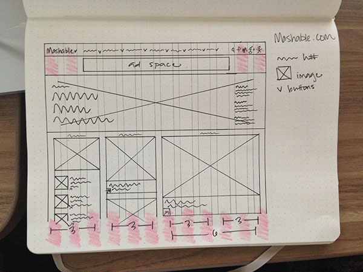
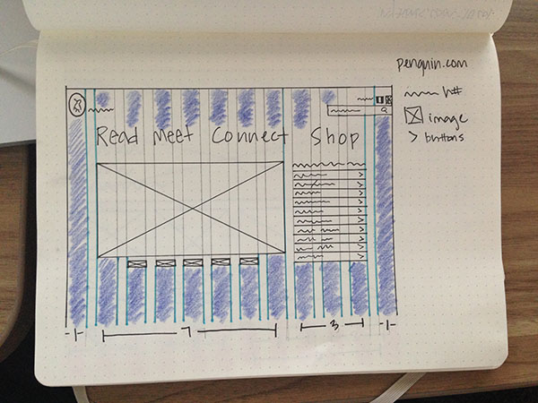
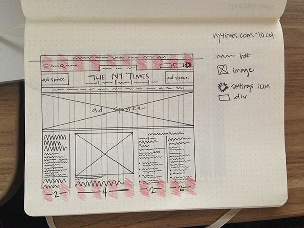
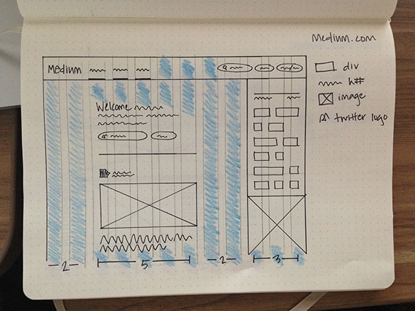
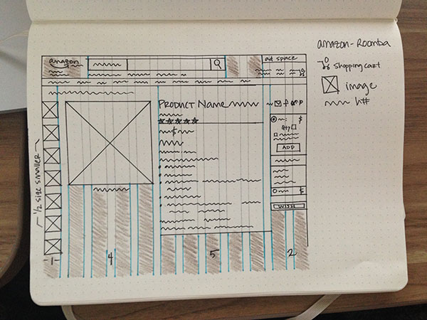
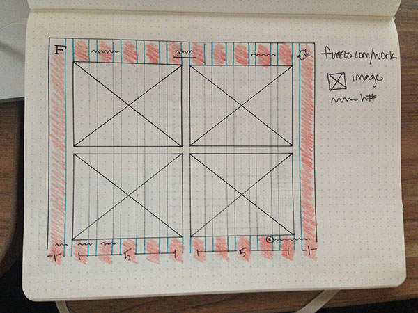
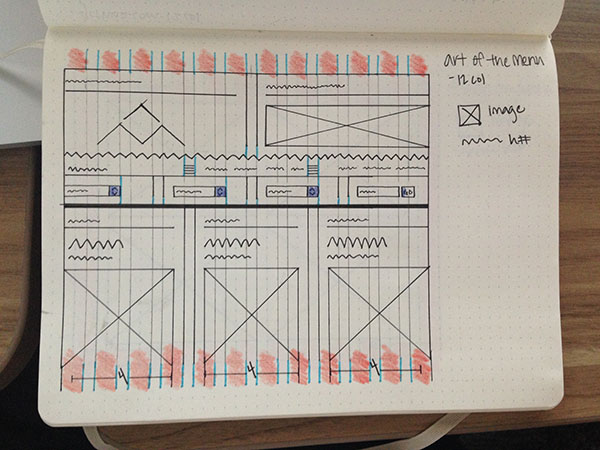
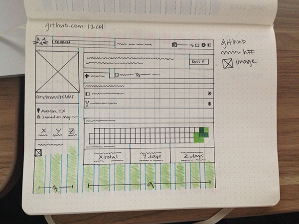
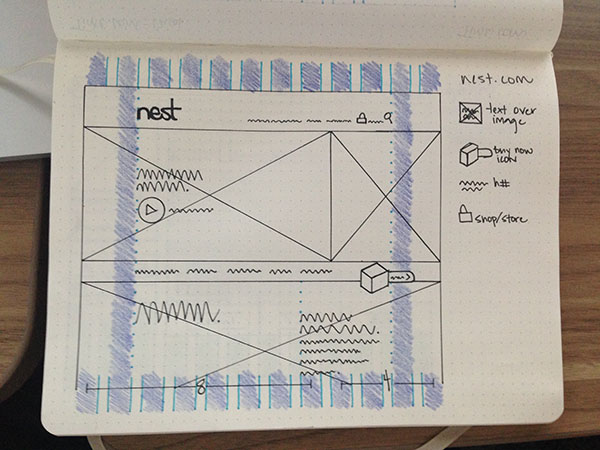
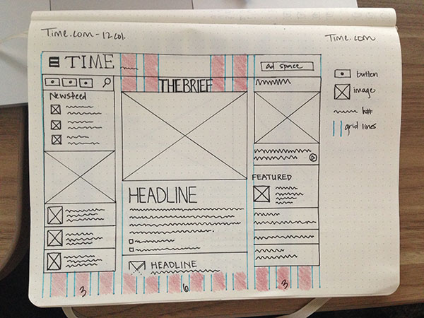

#The Iron Yard, a brief reflection:

##Week One : And we'll all float on, anyway. 
I was so excited for my first day of school. I had been counting down the days for at least 3 months, which made time tick more slowly while also adding to the anticipation. Day one did not disappoint. After some brief introductions, Sam had us jump in head first to the wonderful world of HTML and CSS coding. The subject-matter is challenging, to say the least, and although my brain is in an almost constant state of mush, it also feels like it's gotten the spark that it's needed for so long. I've spent way too many years in boring office jobs, but now I'm finally in a place that challenges and excites me. And I get to go every day! How cool is that? 

##Week Two : Long hours and the (not so) terrifying terminal.
Time is flying by so quickly. When I'm coding, hours pass like minutes. I'm convinced that there's some unexplored time warp going on here, but everyone is too focused on their code to really notice. Or blink. Or eat. Or sleep. Or remember what day it is. We haven't stepped into design much yet, but I know that when we do, the hours will only get shorter. I can't wait! 
This week we also had to face one of my greatest fears-the terminal. I've never touched that scary box because I just knew that with one wrong keystroke I could break my computer forever. In reality, the terminal isn't as scary as I thought. It should be called "the kitten" instead. 

##Week Three : Sassy math
When I chose design as a career, one of the perks was that I would never have to do math again. WRONG. This week, I've had to clear out the cobwebs and get my algebra on in the form of @mixin(s). So far so good, but if they bring in calculus, I might run. 

I hope that later my head will be clearer for more engaging posts. For now, I've squeezed out every last bit of brain juice and I'm in desperate need of a refuel. 

Goodnight World! 

##Week Three update : Gettin' griddy with it 
Assignment: Map out the grids for 10 different websites. Be clean, but not _too_ clean. 

